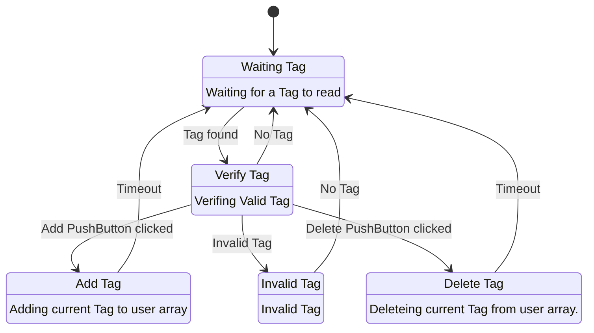

## Finite State Machine

```mermaid 
stateDiagram-v2 
[*] --> WT
state "Waiting Tag" as WT: Waiting for a Tag to read
state "Verify Tag" as VT: Verifing Valid Tag
state "Invalid Tag" as IT: Invalid Tag 
state "Add Tag" as AT: Adding current Tag to user array
state "Delete Tag" as DT: Deleteing current Tag from user array.
WT --> VT : Tag found
VT --> WT : No Tag
VT --> AT : Add PushButton clicked
AT --> WT : Timeout
IT --> WT : No Tag
VT --> IT : Invalid Tag
VT --> DT : Delete PushButton clicked
DT --> WT : Timeout
```
