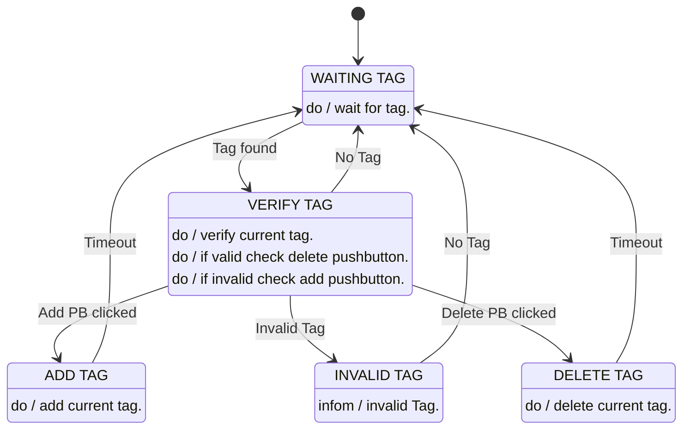

## Hardware Connections
```
                   ┌────────────┐   ┌──────────────────────────┐ 
                   │            │   │         PCF8574          │ 
                ┌──┤GPIO   HI2C2├───┤                          │ 
                │  │PC08        │   │ P0 P1 P2 P3 P4 P5 P6 P7  │ 
     Add      │ o  │            │   └──┬──┬──┬─────┬──┬──┬──┬──┘ 
  PushButton ─┤    │            │      │  │  │     │  │  │  │    
              │ o  │            │   ┌──┴──┴──┴─────┴──┴──┴──┴──┐ 
                │  │            │   │ RS RW  E    D4 D5 D6 D7  │ 
                └──┤   NUCLEO   │   │                          │ 
                   │            │   │         HD44780          │ 
                ┌──┤   F429ZI   │   └──────────────────────────┘ 
                │  │            │                ___  ___        
    Delete    │ o  │            │   ┌─────────┐  \ /  \ / ┌────┐ 
  PushButton ─┤    │            │   │         │   │    │  │    │ 
              │ o  │            │   │         │   │    │  │RFID│ 
                │  │       HI2C1├───┤  PN532  ├───┘    └──┤    │ 
                └──┤GPIO        │   │         │           │TAG │ 
                   │PC09        │   │         │           │    │ 
                   └────────────┘   └─────────┘           └────┘  
```

## Finite State Machine


