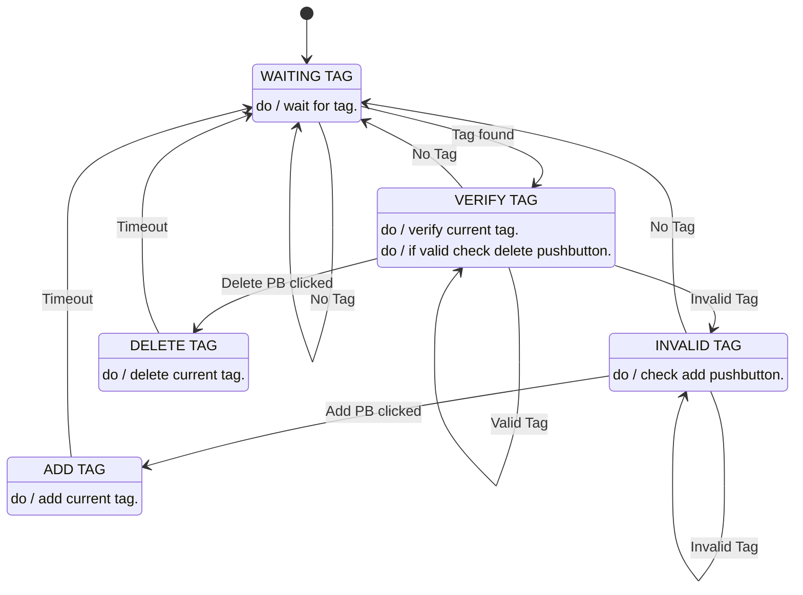

## Hardware Connections
```
┌────────────────────────────────────────────────────────────────┐
│                                                                │
│                  ┌────────────┐   ┌──────────────────────────┐ │
│                  │            │   │         PCF8574          │ │
│               ┌──┤       HI2C2├───┤                          │ │
│               │  │            │   │ P0 P1 P2 P3 P4 P5 P6 P7  │ │
│    Add      │ o  │GPIO        │   └──┬──┬──┬─────┬──┬──┬──┬──┘ │
│ PushButton ─┤    │PC08        │      │  │  │     │  │  │  │    │
│             │ o  │            │   ┌──┴──┴──┴─────┴──┴──┴──┴──┐ │
│               │  │            │   │ RS RW  E    D4 D5 D6 D7  │ │
│               └──┤   NUCLEO   │   │                          │ │
│                  │            │   │         HD44780          │ │
│               ┌──┤   F429ZI   │   └──────────────────────────┘ │
│               │  │            │                ___  ___        │
│   Delete    │ o  │GPIO        │   ┌─────────┐  \ /  \ / ┌────┐ │
│ PushButton ─┤    │PC09        │   │         │   │    │  │    │ │
│             │ o  │            │   │         │   │    │  │RFID│ │
│               │  │       HI2C1├───┤  PN532  ├───┘    └──┤    │ │
│               └──┤            │   │         │           │TAG │ │
│                  │   UART3    │   │         │           │    │ │
│                  └─────┬──────┘   └─────────┘           └────┘ │
│                        │                                       │
│        To PC ◄─────────┘                                       │
│                                                                │
└────────────────────────────────────────────────────────────────┘
```

## Finite State Machine


