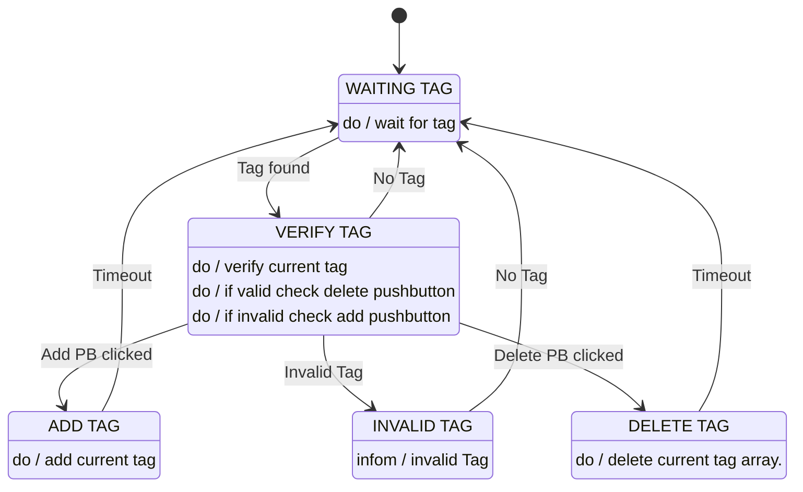

## Finite State Machine

```mermaid 
stateDiagram-v2 
[*] --> WT
state "WAITING TAG" as WT: do / wait for tag
state "VERIFY TAG" as VT: do / verify current tag
VT: do / if valid check delete pushbutton
VT: do / if invalid check add pushbutton 
state "INVALID TAG" as IT: infom / invalid Tag 
state "ADD TAG" as AT: do / add current tag
state "DELETE TAG" as DT: do / delete current tag array.
WT --> VT : Tag found
VT --> WT : No Tag
VT --> AT : Add PB clicked
AT --> WT : Timeout
IT --> WT : No Tag
VT --> IT : Invalid Tag
VT --> DT : Delete PB clicked
DT --> WT : Timeout
```
